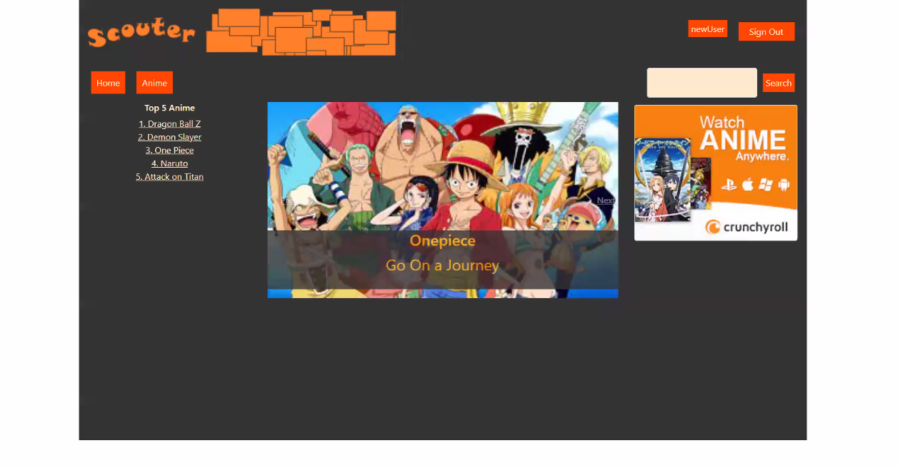

# Scouter-FrontEnd
This is the front-end repository. If you haven't already installed the [Backend](https://github.com/j-m-smith426/Team-4-Project-1), proceed to the backend and come back once the installation is complete.

## Project Description
Scouter is a social web application designed to be a community for anime viewers. With Scouter, a user can log in by creating and verifying their account through email. Then, the user may proceed to exploring specific anime pages as well as other users' profile pages. Users can post comments on an anime page and see what other people of the Scouter community have discussed. A user with particular interest in an anime may click the Favorite button to add it to their favorites list located in their profile page. A user can also add information about themselves in their profile page and even post comments or pictures. 

## Technologies and Languages Used
* NodeJS - 16.3.0
* AWS V3 - Cognito, DynamoDB, Amplify, S3
* React - 17.0.2
* Redux - ^4.1.0
* TypeScript - ^4.3.4

## Features

List of features ready and TODOs for future development
* Login/SignUp authentication
* Profile Page - editing bio, looking at favorites list, posting on personal page
* Navigation across profile page to anime page
* Search bar for anime
* Posting feature - both text and photo on the profile/anime page
* Favorite button on anime page
* Interacting with carousel

To-do list:
* Implement a rating for each anime
* Implement followers between users
* Work on user design (improving placement of components and visual appeal)
* More comprehensive frontend testing

## Getting Started
Both the Frontend and Backend should be cloned and set up. If the Backend has not been installed, proceed to the [Backend repository](https://github.com/j-m-smith426/Team-4-Project-1) and get up to speed by finishing its respective **Getting Started** section.

To clone the repository, run the following command in your terminal:
```powershell
git clone https://github.com/j-m-smith426/Team-4-Project-1-FrontEnd.git
```
Alternatively, if you have Github Desktop, you can click on **Code** and **Open with Github Desktop**.
Be sure [NodeJS](https://nodejs.org/en/download/) is installed as well as a text editor. We used [Visual Studio Code](https://code.visualstudio.com/download).

To check if NodeJS and Node Package Manager installed correctly, run the following command:
```powershell
node --version
npm --version
```
Both should result in a version display.
Once installed, open up the root of the repository and install Scouter's dependencies: 
```powershell
npm install
```
This will read from the package.json and install all necessary dependencies, including React and TypeScript. At this point, everything should be ready.
**Both the Frontend and Backend repositories must be set up before proceeding!**

Now, you are ready to run the application. Open up the backend and run:
```powershell
npm run start:dev
```
In the frontend, run:
```powershell
npm start
```
Now, you have access to Scouter!

## Usage


----
The above photo is Scouter's Home Page for a user going by the handle 'newUser'.
For a user who hasn't created an account, click on the **Sign Up** button on the top right screen and enter your Username, Password, and Email. The user will receive an email regarding verification. Once enabled, sign in to fully access all the features Scouter has to offer.


The search bar and all the links are functional. You may choose to navigate to a specific anime page by either clicking the links on the left side of the page, the **Anime** button next to **Home**, or typing in an anime and searching for it through the Search Bar on the right side of the screen.


Once on an anime page, you will see the anime cover photo, a synopsis, and all the posted comments from previous users. If a user particularly likes that anime, they may click on the **Favorite** button and that anime's information will be sent to your profile page. To navigate to a different user's profile page, click on their handle located on the top left of their comment and you will be able to see their comments, bio, and favorites' list.


To get to your profile page, click on your username -- in this case **newUser** located next to the **Sign Out** button. Here you may post a photo or comment on your profile page located in the center of the screen or edit your bio on the left side of the screen. You may also choose to display all of your Favorited anime by clicking the **Favorite** button located next to your bio.

## Contributors
Scouter Developers:
* Joab Smith 
* Nick Wang 
* Matthew Hanrahan 
* Imran Ilyas
